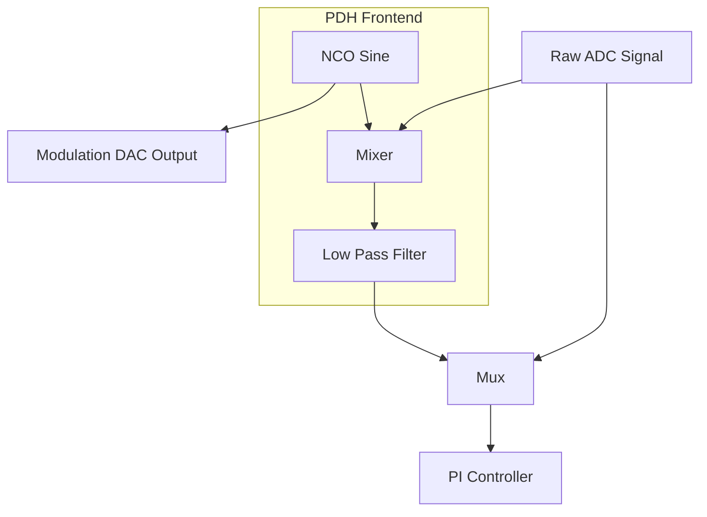

# 9. PDH Subsystem Architecture

The Pound-Drever-Hall (PDH) subsystem provides a synchronous demodulation path that can be dynamically inserted upstream of the existing feedback controller, replacing the raw DC ADC signal.

## Architecture

The system consists of the following components:

1. **NCO (Numerically-Controlled Oscillator)**: Generates a 16-bit phase-coherent sine and cosine reference. It uses a 32-bit phase accumulator and a 256-entry quarter-wave lookup table.
2. **Demodulator**: A digital mixer that multiplies the 17-bit raw ADC signal with the 16-bit NCO reference. The product is scaled (right-shifted by 13) and saturated to 20 bits.
3. **Low-Pass Filter (LPF)**: A first-order IIR filter with programmable bandwidth (via bit-shift) that removes the sum-frequency components.
4. **PDH Frontend (Mux)**: The top-level wrapper that instantiates these blocks and selects between the PDH error signal and the direct ADC signal based on `PDH_ENABLE`.

## Register Interface

The PDH block is controlled by a dedicated register block at `0x200`:

- `0x200` **PDH_CONTROL**: Enable bit (0).
- `0x204` **PDH_MOD_FREQ**: 32-bit unsigned phase increment per clock.
- `0x208` **PDH_MOD_AMP**: 16-bit unsigned amplitude scaling factor (Q2.14).
- `0x20C` **PDH_DEMOD_PHASE**: 32-bit unsigned phase offset applied to the NCO reference before mixing.
- `0x210` **PDH_LPF_ALPHA**: 5-bit unsigned filter bandwidth parameter.

## Fixed-Point Formats

- **ADC Input**: Signed 17-bit integer.
- **NCO Output**: Signed 16-bit integer (amplitude ±32766).
- **Mixer Output**: Signed 20-bit integer.
- **Modulation DAC**: Signed 16-bit integer (scaled by Q2.14 amplitude).
